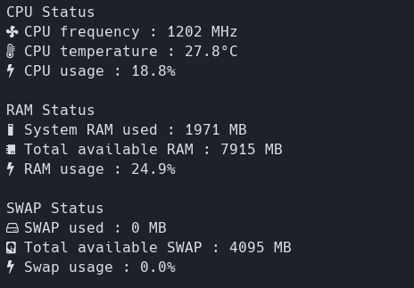

# Sysfetch
A minimal tool to display system stats.
<br>


## Dependencies

* [python](https://www.python.org/) - For obvious reasons.
* [psutil](https://pypi.org/project/psutil/) - Python library for getting system information.
* [Nerd Font Hack](https://github.com/ryanoasis/nerd-fonts/tree/master/patched-fonts/Hack) - Patched font used to display icons.
 
<br>

## Screenshots



<br> 

## Installation 

### Symbolic Link

1. Clone this repository

``` html
git clone https://github.com/BiswasJishnu/Sysfetch.git

```

2. Copy the program

``` html
mkdir ~/.sysfetch
cd Sysfetch
cp sysfetch_curses.py sysfetch_functions.py ~/.sysfetch/

```

> * Over here the python file from the git repo directory is being copied to .sysfetch directory. You may change the location.

3. Make sure python dependencies are installed

``` html
pip3 install -r requirements.txt
or 
pip install -r requirements.txt

```
4. Make the file executable

``` html
cd ~/.sysfetch
sudo chmod +x sysfetch_curses.py

```

5. Create the symbolic link

```html
sudo ln -s /path/to/sysfetch/sysfetch_curses.py /usr/bin/sysfetch

```

Now you can run the program with 

```html
$ sysfetch
```

> * Incase you need to remove the symbolic link use the command below

```html
sudo rm /usr/bin/sysfetch
```

